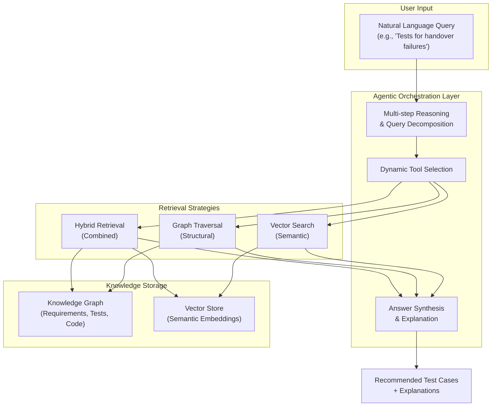

# Agentic GraphRAG for Test Scope Analysis

[](https://liu.se)
[](LICENSE)
[](https://www.python.org/downloads/)
[](https://github.com/microsoft/graphrag)

> **Master's Thesis Research Project**  
> **Author**: Berkay Orhan  
> **Institution**: Linköping University, Department of Science and Technology  
> **External Partner**: Ericsson  
> **Year**: 2026

A research implementation exploring agent-orchestrated GraphRAG systems for automated test case recommendation in enterprise software development, specifically addressing test scope analysis challenges in telecommunications systems.

## ⚠️ Academic Research Project

This repository contains the implementation for a Master's Thesis in Computer Science. The code is made publicly available for:
- Academic transparency and reproducible research
- Peer review and thesis evaluation
- Educational purposes and research community benefit

**Important**: This is a research artifact, not a production-ready commercial product.

## Overview

### Research Context

In large-scale enterprise software development, **test scope analysis** - the task of identifying relevant legacy test cases for new features, changes, or defect fixes - remains a significant bottleneck. Traditional keyword-based search and static trace links are increasingly inadequate for handling the semantic complexity of modern telecommunications systems.

This thesis investigates how autonomous AI agents can orchestrate GraphRAG (Graph-based Retrieval-Augmented Generation) pipelines to automate test case retrieval, identify coverage gaps, and provide explainable recommendations.

### Research Questions

- **RQ1**: What ontology design is required to model semantic dependencies between unstructured requirements and structured test artifacts within a Knowledge Graph to enable semantic retrieval?

- **RQ2**: To what extent does an agent-orchestrated GraphRAG approach improve retrieval accuracy compared to standard keyword-based and vector-only RAG methods?

- **RQ3**: To what extent do software practitioners at Ericsson find the automated recommendations accurate and the provided justifications sufficient for decision-making?

## Key Features

### Planned Architecture

The thesis implementation will explore:

#### Agent Orchestration
- **Agentic AI Framework**: Autonomous agents that perceive requirements, reason about test coverage, and orchestrate retrieval strategies
- **Human-in-the-Loop (HITL)**: Interactive workflows for validation and refinement
- **Multi-step Reasoning**: Decomposition of complex queries into intermediate lookups
- **Explainable Recommendations**: Transparent rationales for test scope suggestions

#### Hybrid Storage & Retrieval
- **Knowledge Graph**: Structured representation of software entities and relationships (Requirements, Test Cases, Code)
- **Vector Search**: Semantic similarity for conceptual matching
- **Graph Traversal**: Structural reasoning over dependencies and trace links
- **Hybrid Approaches**: Combining semantic and structural information

#### Evaluation Framework
- **Retrieval Metrics**: Precision@k, Recall@k, MAP, MRR, F1@k
- **Qualitative Analysis**: Practitioner feedback from Ericsson engineers
- **Comparative Studies**: Baseline (keyword) vs. vector-only RAG vs. agent-orchestrated GraphRAG

## Architecture

The proposed system architecture integrates agentic reasoning with hybrid retrieval:



## Repository Structure

This repository builds upon Microsoft's GraphRAG framework:

### GraphRAG Base Framework (`/graphrag`)
Fork of [Microsoft's GraphRAG](https://github.com/microsoft/graphrag) - the foundation for knowledge graph extraction and querying.

- See [AGENTS.md](AGENTS.md) for GraphRAG development workflow
- See [Microsoft's documentation](https://microsoft.github.io/graphrag) for detailed usage

### Thesis Implementation (`/agentic-graphrag-thesis`)
Research code for the Master's thesis:

```
agentic-graphrag-thesis/
├── src/
│   └── agentic_graphrag/     # Thesis implementation package
│       ├── agents/           # Agent orchestration logic
│       ├── knowledge_graph/  # KG ontology and storage
│       ├── retrieval/        # Retrieval strategies
│       ├── evaluation/       # Metrics and experiments
│       └── data/             # Data loaders and processors
├── thesis-paper/             # LaTeX thesis manuscript
│   ├── thesis.tex
│   ├── intro.md
│   ├── theory.tex
│   ├── method.tex
│   ├── references.bib
│   └── figures/              # TikZ diagrams
├── experiments/              # Experimental results and notebooks
├── tests/                    # Unit and integration tests
└── AGENTS.md                 # Thesis-specific documentation
```

## Getting Started

### Prerequisites

- Python 3.10-3.12
- `uv` package manager (recommended) or `pip`

### Installation

**1. Install GraphRAG base framework:**
```bash
# From root directory
uv sync
```

**2. Install thesis implementation:**
```bash
cd agentic-graphrag-thesis
uv sync
```

**3. Configure environment:**
```bash
# Create .env file with your API keys
cp .env.example .env
```

### Running GraphRAG (Base Framework)

```bash
# Initialize a GraphRAG project
uv run poe init

# Run indexing on documents
uv run poe index --root <path>

# Query the knowledge graph
uv run poe query --root <path> --method global --query "Your question"
```

See [AGENTS.md](AGENTS.md) for complete GraphRAG workflow and commands.

### Thesis Development

For thesis-specific development and experiments:

```bash
cd agentic-graphrag-thesis

# Run thesis experiments (implementation in progress)
uv run python -m agentic_graphrag.experiments.run

# Run evaluation
uv run python -m agentic_graphrag.evaluation.evaluate
```

See [agentic-graphrag-thesis/AGENTS.md](agentic-graphrag-thesis/AGENTS.md) for detailed thesis documentation.

## Knowledge Graph Ontology (RQ1)

The thesis proposes a custom ontology for modeling software engineering entities:

### Planned Entity Types
- **Requirement**: System requirements with priorities and metadata
- **TestCase**: Test cases with type classifications (unit, integration, protocol, system)
- **Function**: Code functions with signatures and complexity metrics
- **Class**: Code classes with methods and inheritance
- **Module**: Code modules/packages

### Planned Relationship Types
- **VERIFIES**: TestCase → Requirement (test validates requirement)
- **COVERS**: TestCase → Function/Class (test exercises code)
- **CALLS**: Function → Function (function dependencies)
- **DEFINED_IN**: Function/Class → Module (code organization)
- **INHERITS_FROM**: Class → Class (inheritance hierarchy)
- **DEPENDS_ON**: Requirement → Requirement (requirement dependencies)

### Research Goal
Design and evaluate how this ontology enables semantic retrieval for test scope analysis, compared to flat document representations.

## Retrieval Strategies (RQ2)

The thesis will implement and compare multiple retrieval approaches:

### 1. Baseline: Keyword Search
Traditional lexical matching (e.g., BM25, TF-IDF) on test case descriptions.

### 2. Vector-Only RAG
Semantic similarity using embedding models, without graph structure.

### 3. Graph Traversal
Pure structural reasoning over the knowledge graph (e.g., following VERIFIES and COVERS relationships).

### 4. Agent-Orchestrated GraphRAG
Autonomous agents that dynamically select and combine retrieval strategies based on query characteristics.

### Evaluation Metrics
- **Precision@k**: Relevance of top-k retrieved test cases
- **Recall@k**: Coverage of relevant test cases
- **MAP (Mean Average Precision)**: Average precision across all queries
- **MRR (Mean Reciprocal Rank)**: Rank of first relevant result
- **F1@k**: Harmonic mean of precision and recall

## Human-in-the-Loop (RQ3)

The thesis will explore interactive workflows where:
- Engineers validate agent reasoning steps
- Ambiguous queries trigger clarification dialogs
- Agents explain their retrieval strategy choices
- Practitioners provide feedback on recommendation quality

Qualitative evaluation through interviews and surveys with Ericsson engineers.

## Development

### Code Quality
```bash
# Format code
uv run poe format

# Lint and type check
uv run poe check

# Run tests
uv run poe test
```

### Thesis Paper

The LaTeX thesis manuscript is in `agentic-graphrag-thesis/thesis-paper/`:

```bash
cd agentic-graphrag-thesis/thesis-paper

# Compile thesis
xelatex thesis.tex
biber thesis
xelatex thesis.tex
xelatex thesis.tex
```

Includes TikZ diagrams for:
- Agent architecture
- RAG pipeline
- Knowledge graph ontology
- Semantic chunking
- Hybrid search flow

## Documentation

- **[AGENTS.md](AGENTS.md)** - GraphRAG framework development guide
- **[agentic-graphrag-thesis/AGENTS.md](agentic-graphrag-thesis/AGENTS.md)** - Thesis project documentation
- **[GraphRAG Documentation](https://microsoft.github.io/graphrag)** - Microsoft's GraphRAG docs
- **[GraphRAG Arxiv Paper](https://arxiv.org/pdf/2404.16130)** - Original GraphRAG research

## Contact

**Berkay Orhan**  
Master's Student, Computer Science  
Linköping University  
Email: beror658@student.liu.se